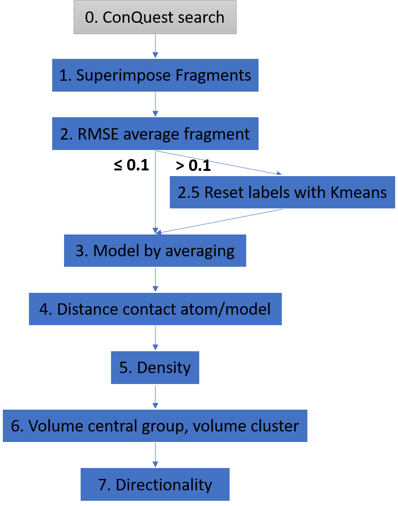
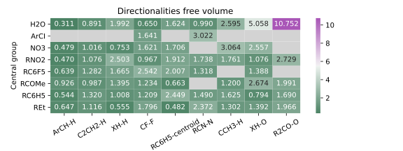

# Handbag: Handbag assesses novel directionality of bimolecular aggregates
This is the implementation of project Handbag. It finds and quantifies the directionality of intermolecular interactions. This project was developed for the thesis that I did for 't van het Hoff Institute for Molecular Sciences at the UvA.

Supervisor: dhr. dr. T.J. (Tiddo) Mooibroek
Author: Natasja Wezel (BSc)

## What it does
It takes as input orthogonal data from fragments. This data can be obtained from the Cambridge Structural Database, using ConQuest. You have to specify the central group and contact group, and the program will calculate the directionality coefficient. In the figure below, the steps of the program are given.

* Step  0: the  data  needs  to  beobtained by doing a conquest search. That  data  can  be  fed into the program;  the labels need to be specified to be able to do the su-perimposition
* Step 1: the RMSE  of  the  averaged  fragment  is calculated
* Step 2: If the RMSE is > 0.1, the labels of the fragments are resetted with k-means (step 2.5)
* Step 3: The central group model is made by averaging each atom with the same label. 
* Step 4: A reference point the contact group has to be specified (a single atom, or a centroid) and for all these reference points, the distance to the closest atom of the central group model is calculated 
    * A plot of this can be inspected, with a distance-slider to show all reference points, or only those in a certain distance
    * Fingerprint plots of the contact pair are made after this step
* Step 5: The densityis calculated at a resolution of 0.3
    * The density can be inspected as well in a plot with two sliders: one for threshold (what bins to show), and one for resolution (how big the bins are)
* Step 6: The volumes are calculated.
* Step 7: With the volume, the directionality is calculated, which was the ultimate goal.

This GitHub project contains the source code for all separate steps in separate scripts, and also contains a Command Line Interface which makes it possible to walk through the pipeline step-by-step. For a detailed tutorial on how to use the CLI click [here](docs/TUTORIAL.md).

This is a GIF showing one of the 4D density plots made with this program:

## Results

## Installation
For installation guidelines, click [here](INSTALLATION.md).

## Replicating experiments
The code for easily running the pipeline on lots of contact pairs is found in the [jupyter notebooks](src/notebooks).

The original data is found here # TODO: where to store the data so it can be downloaded?

## Contributing
Pull request templates are provided. Issues and pull requests are always welcome.
For other questions, you can always contact me at natasjawezel@gmail.com!
