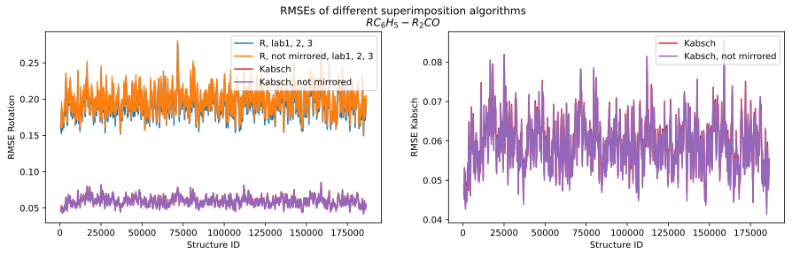
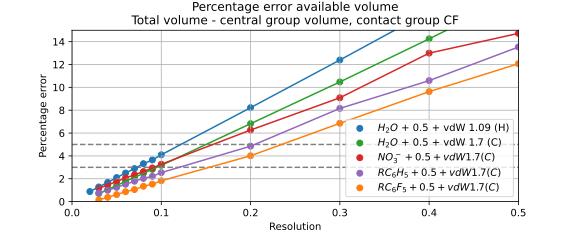
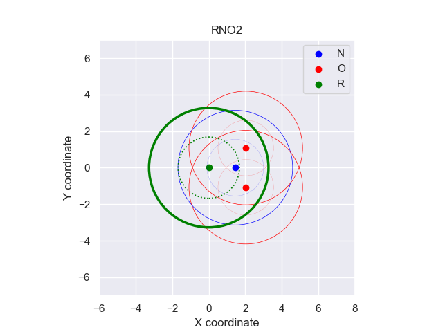

# Notebooks
Most of these notebooks are only interesting if you have the original data. They are meant to be able to repeat the experiments and to calculate large amounts of directionalities at once, instead of having to go through the pipeline step-by-step for each contact pair

## Obtaining (large amounts of) data
### Run everything: ```run_all_computational_time```

## Alignment and central group model
### Compare RMSE of different alignments (kabsch, rotation): ```compare_rmses_alignment```
In this notebook, we find out what the best way is to align the fragments. We do this by comparing different rmse's of different superimposition (alignment) methods.

One of the results is the following:


NB: You can obtain the results from rotation by running the separate rotation alignment script.

### Check the RMSEs of alignment and average fragment: ```avg_frag_rmse_check```
Contains the code that is used to calculate the RMSE of average fragment.
* Experiment 1: The average RMSE of the kabsch alignment is calculated.
* Experiment 2: The RMSE if the labels are averaged.
* Experiment 3: The end RMSE, where k-means was used to reset the labels if neccessary (RMSE > 0.1).

## Resolution and threshold
### Chosing resolution and threshold: ```directionality_dependency_res_and_threshold```

## Volumes central group
### How the resolution for the central group volume is determined: ```volume_central_groups```


### How the volume for central groups with an R in it is calculated: ```volume_R_groups```
Reasoning about why R groups should be half in the min volume, and not in the max volume. This is done with pictures like the following:



## Directionality
### Calculate directionalities for a list of contact pairs: ```calc_all_directionalities```
Contains the code that is used to make directionality tables for all contact pairs. A result would look like the following table.


Density calculations need to be already performed, and the volumes of the contact pairs need also already to be calculated.

### Get information about how many points are needed for a reliable directionality: ```compression_test```
TODO
This notebook not only plots already existing results, but also runs the compression algorithm itself. 

bla bla

compression test example


```plot_fragments_with_labels```


